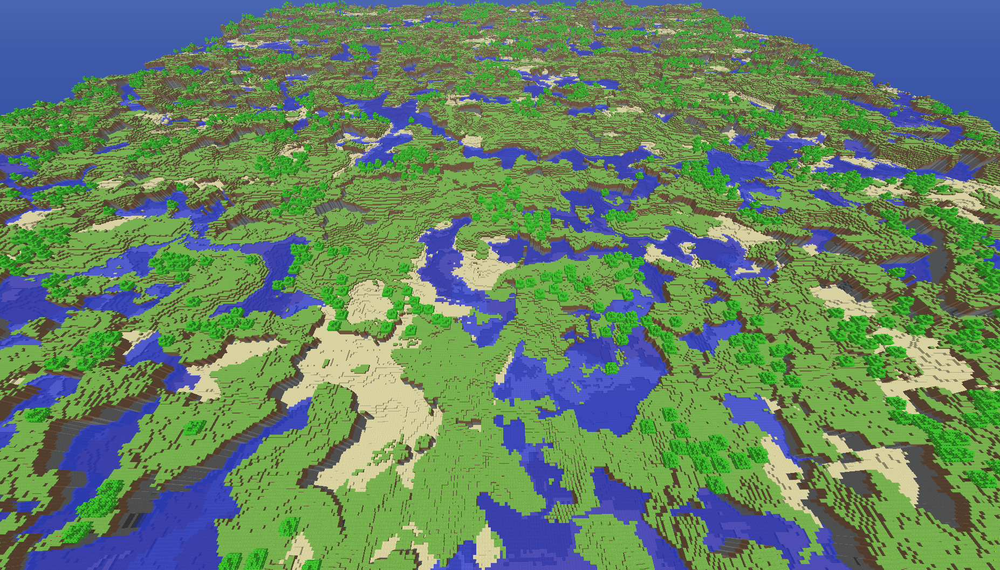
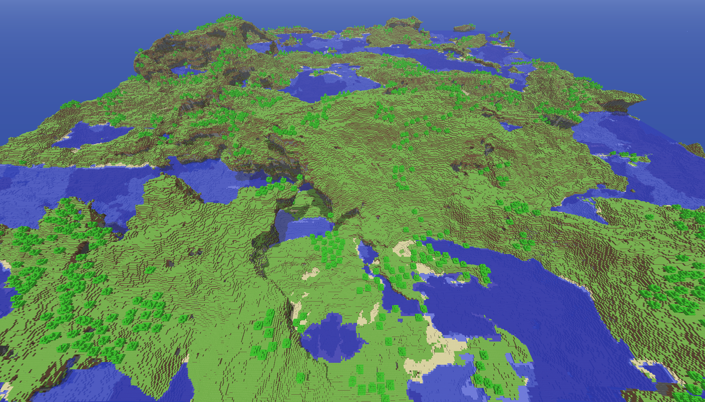
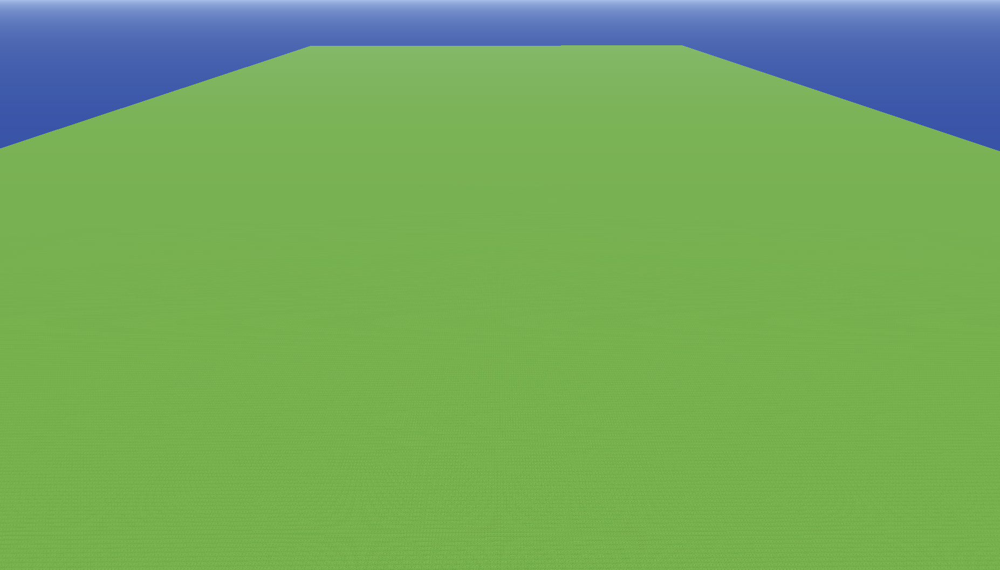
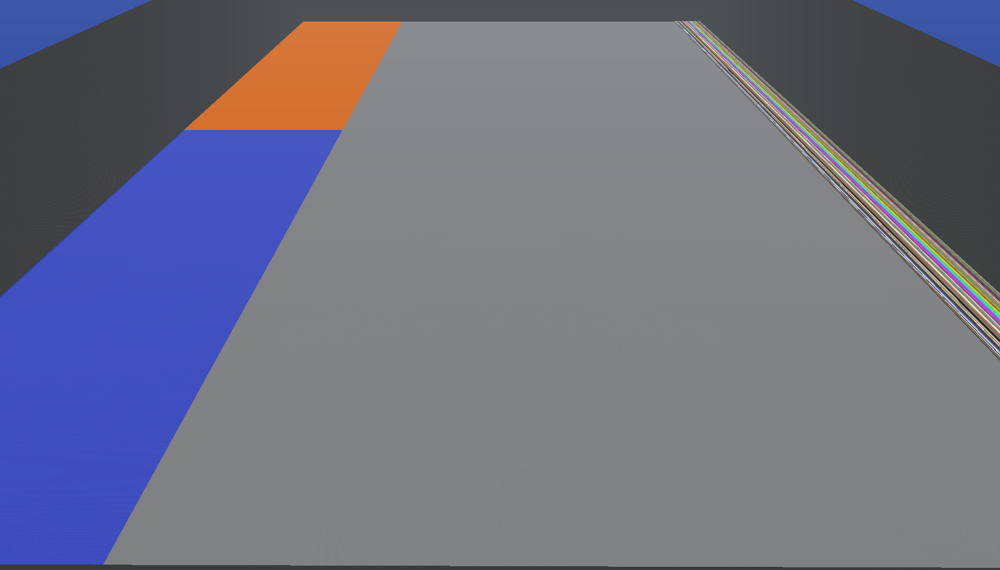

Map generators
==============

All screenshots generated on a 1024x256x1024 world with the seed 12345.

## `classic`

Minecraft Classic level generator.

## `seantest`

Experimental level generator, with rough terrain and overhangs plus caves that open at the surface.

## `flat`

Typical flat level generator, with layers of grass, dirt, and stone.

## `debug`

Contains every block available, plus pools of water and lava for testing liquid physics.

## `random`

Filled with all available blocks randomly.
Mostly useful for testing level compression.